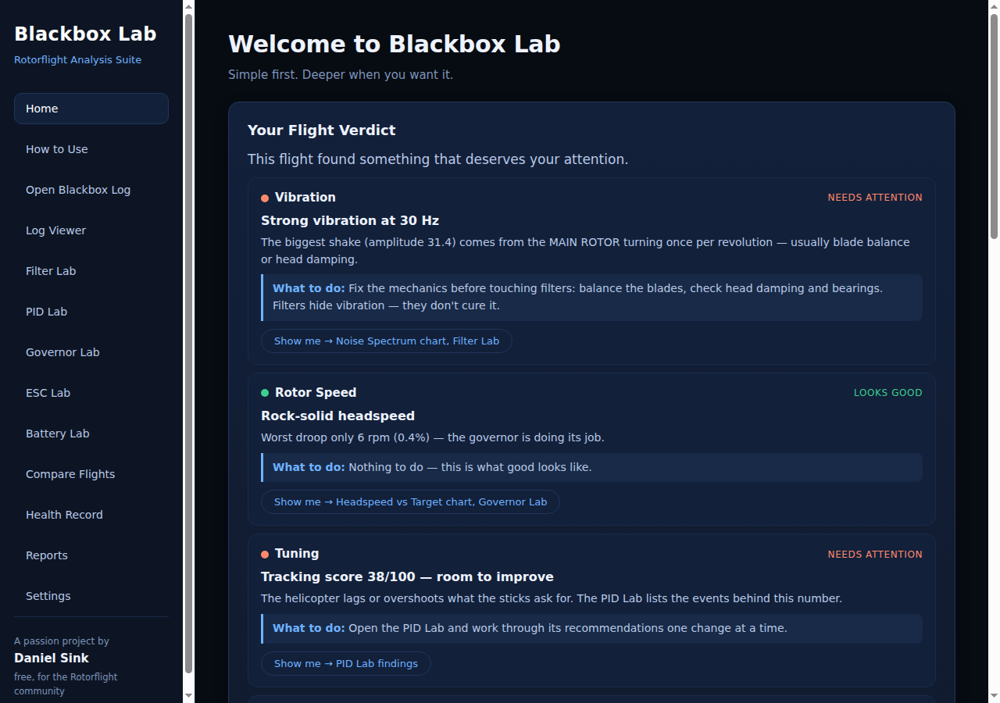
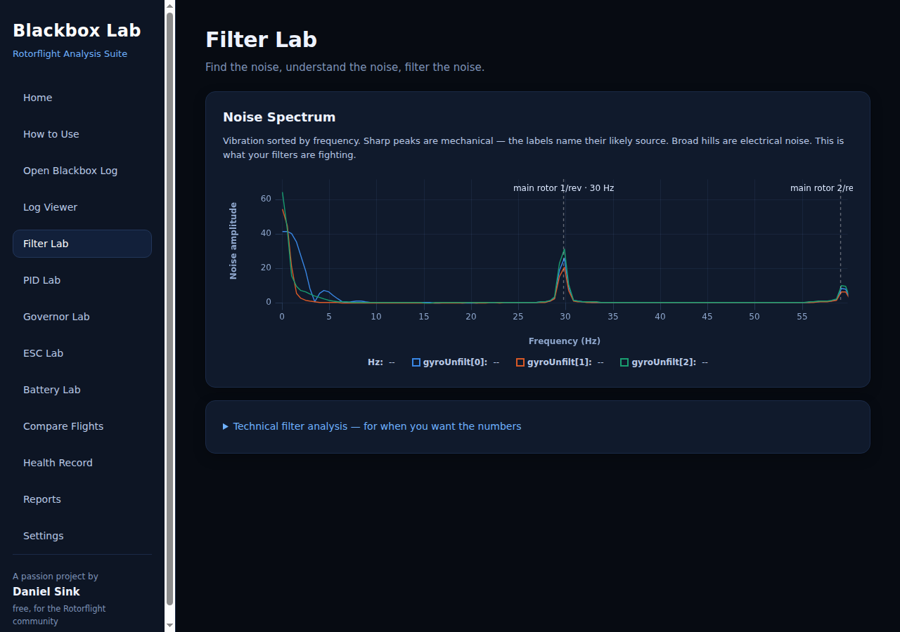
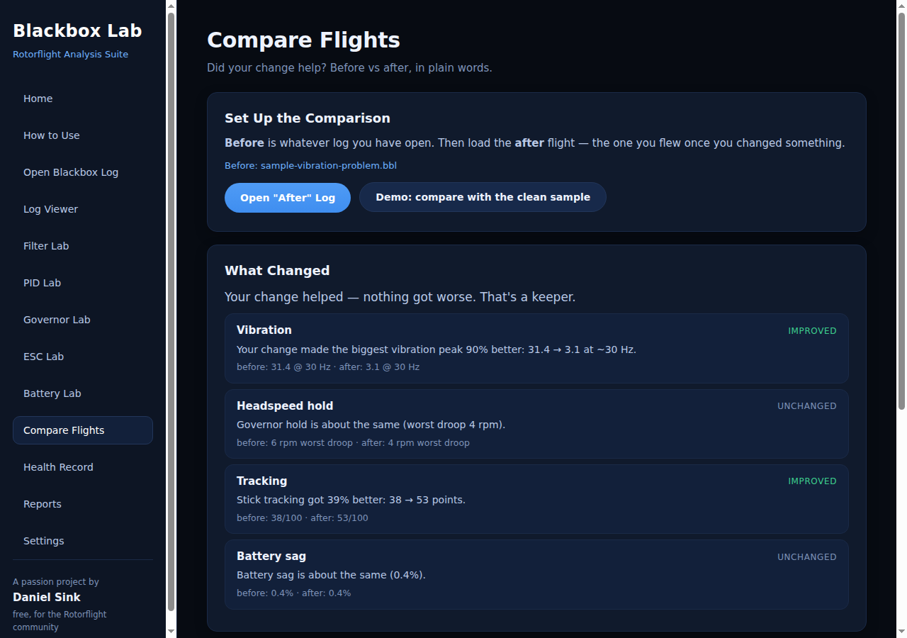

# Blackbox Lab

**Professional Rotorflight Analysis Suite**

> **Simple first. Deeper when you want it.**

Blackbox Lab is an open-source desktop application designed to make Rotorflight Blackbox log analysis simple for beginners while remaining powerful enough for advanced pilots.

---

## What It Looks Like

**Open a log — get answers, not data.** Every flight lands on a
plain-language verdict with a "what to do" line and one-click
evidence:



**Evidence you can see.** The Filter Lab's noise spectrum labels
each peak with its likely mechanical source:



**Did your change help?** Compare two flights and get the answer
in one sentence per topic:



## Mission

Most Blackbox tools assume you already know how to read logs.

Blackbox Lab explains what happened during the flight using plain English and provides recommendations that help improve tuning, reliability, and confidence.

---

## Planned Features

- Automatic Blackbox Analysis
- Governor Performance Reports
- PID Health Reports
- Servo Activity Reports
- ESC Performance Reports
- Battery Performance Reports
- Flight Playback
- Rotorflight Configuration Review
- Beginner & Advanced Modes
- One-click Report Generation

---

## Design Philosophy

Simple first.

Deeper when you want it.

---

## Working Today (v0.2)

- **Native .bbl decoding** — open raw Blackbox files straight off
  the flight controller, no CSV conversion. Multi-flight files
  supported, corrupt bytes skipped gracefully.
- **Charts** — gyro, setpoint-vs-gyro tracking, headspeed &
  governor, motor & power. Drag to zoom.
- **Noise spectrum** — built-in FFT shows vibration by frequency
  in the Filter Lab.
- **Filter & PID analysis** — scores, findings, confidence and
  recommendations in plain language.
- **Flight Verdict** — answers first: plain-language cards with
  status, cause, what to do, and a jump straight to the evidence.
- **Governor, ESC & Battery Labs** — droop analysis, throttle
  headroom & saturation, voltage sag, estimated pack internal
  resistance and consumed capacity.
- **Compare Flights** — before vs after: "your change made the
  biggest vibration peak 86% better."
- **Health Record** — every analyzed flight is filed per craft
  (locally); rising vibration or droop across flights triggers a
  warning before something breaks.
- **One-file reports** — verdict, findings and charts in a single
  shareable HTML file.
- **Sample flights** — three ready-made logs in `samples/` (with
  documented ground truth) so you can explore without a log at
  hand ("Try a Sample Flight" — one click). These are recordings
  for the app — not firmware, nothing is ever written to a
  helicopter.

## Quick Start

```
npm install
npm start        # run the app
npm test         # run the test suite
```

Then click "Open Blackbox Log" and pick a `.bbl`, `.csv` or CLI
dump — or try `samples/sample-vibration-problem.bbl` and visit
the Filter Lab.

## Status

🚧 Active Development

Built with Electron and JavaScript.